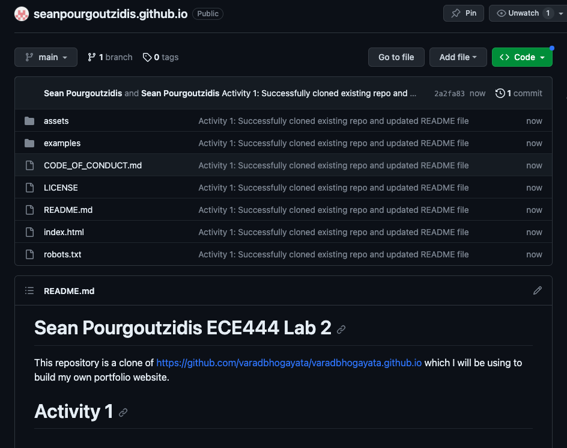
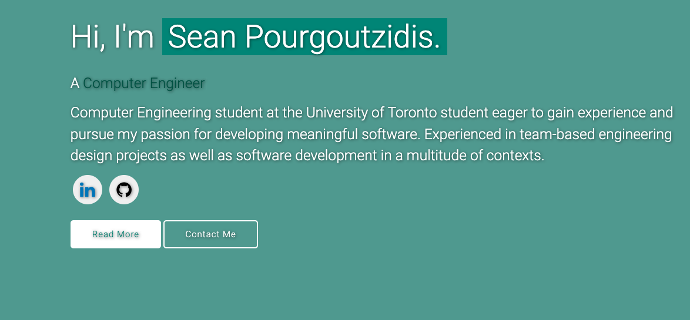
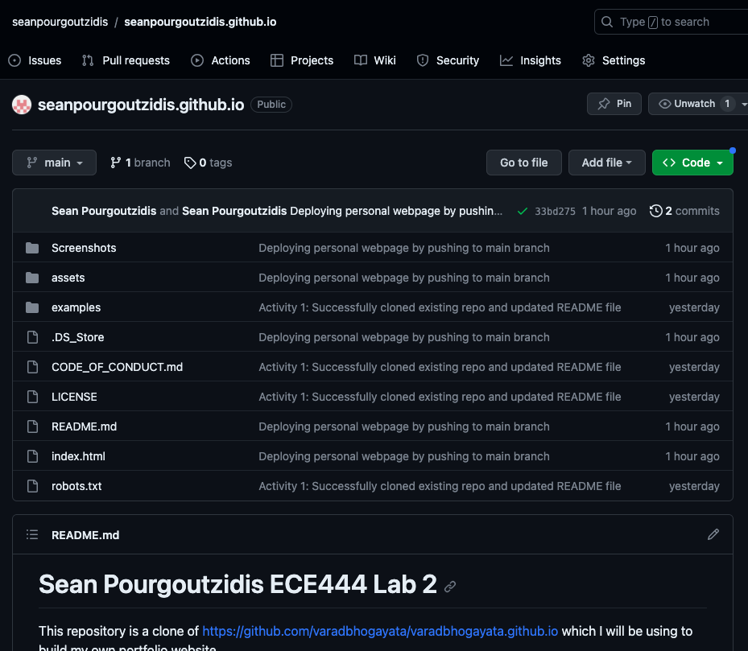
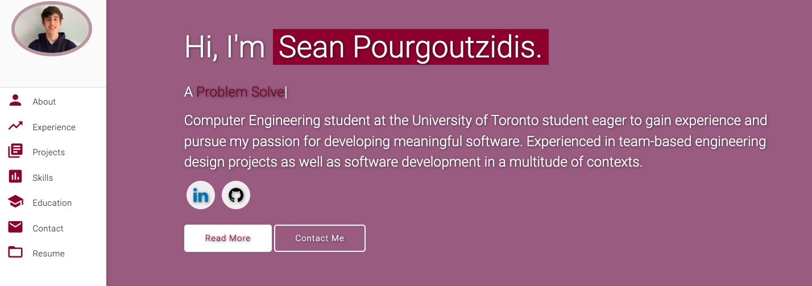
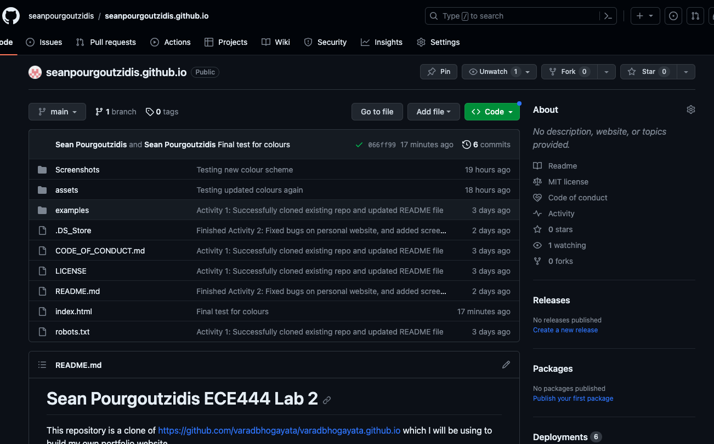
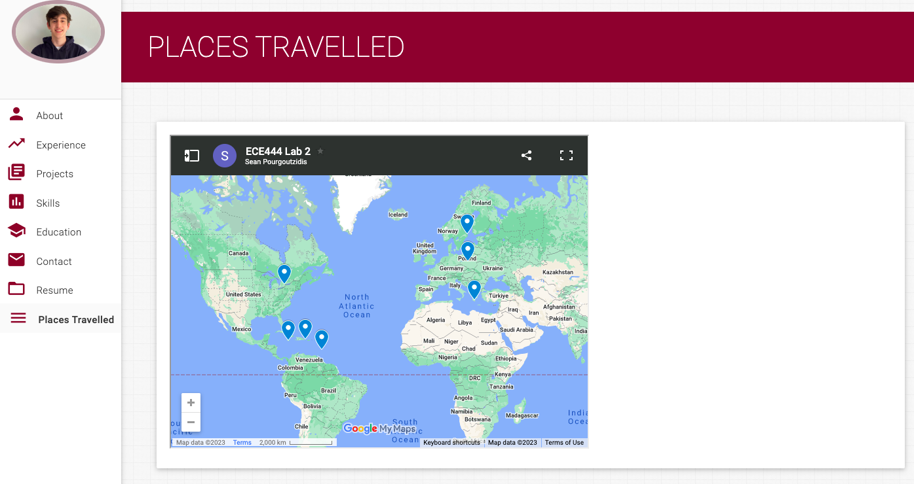
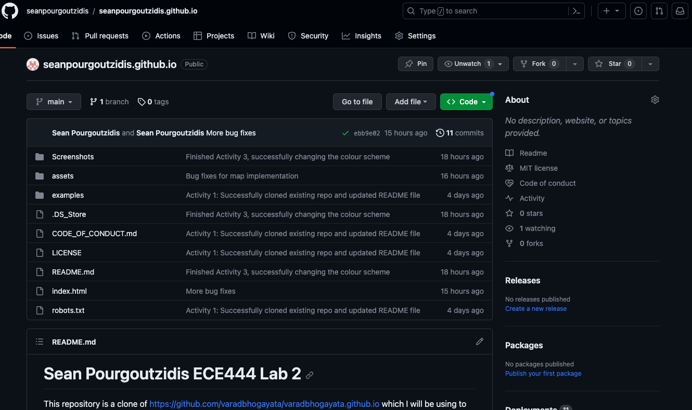

# Sean Pourgoutzidis ECE444 Lab 2

This repository is a clone of https://github.com/varadbhogayata/varadbhogayata.github.io which I will be using to build my own portfolio website.

# Activity 1

# Activity 2

# Activity 3

# Activity 4

## License
This project is licensed under the MIT License - see the [LICENSE.md](./LICENSE) file for details.
